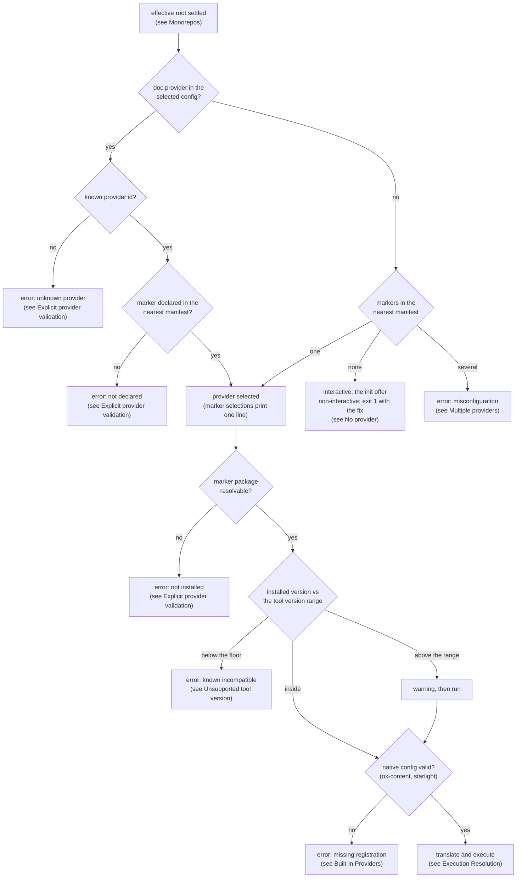
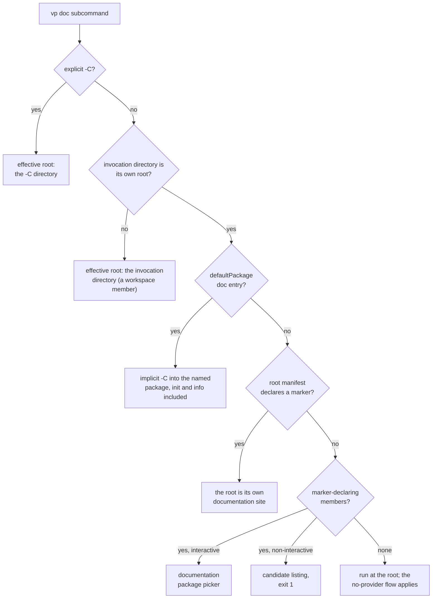
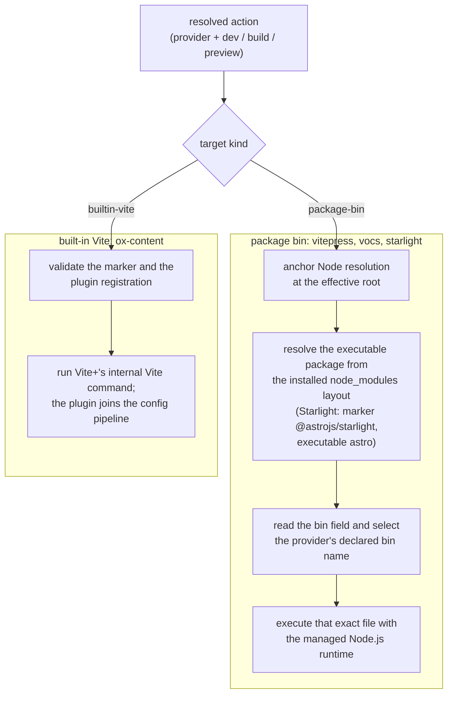

# RFC: Multi-provider `vp doc` Command

- Status: Proposed
- Related: [package-manager-detection.md](./package-manager-detection.md),
  [merge-global-and-local-cli.md](./merge-global-and-local-cli.md),
  [cwd-flag.md](./cwd-flag.md),
  [packages/cli/BUNDLING.md](../packages/cli/BUNDLING.md),
  [discussion #2445](https://github.com/voidzero-dev/vite-plus/discussions/2445)

## Summary

Add a public `vp doc` command for developing, building, and previewing
documentation sites:

```bash
vp doc
vp doc dev
vp doc build
vp doc preview
```

This RFC calls the selectable documentation integration a **provider** and
the underlying documentation generator a **tool**. The project selects a
provider; Vite+ detects it from declared dependencies, translates the common
actions, `dev`, `build`, and `preview`, and executes the tool. The name
follows Vitest's `browser.provider` and `coverage.provider`, which select an
implementation the same way. [discussion #2445] calls the internal mapping
code an adapter; that word stays internal.

Vite+ bundles no documentation generator and forces no single choice. Most
providers execute a project-installed CLI. Vite-plugin providers execute
Vite+'s existing Vite command.

[discussion #2445]: https://github.com/voidzero-dev/vite-plus/discussions/2445

The initial built-in providers are:

- [VitePress 2](https://github.com/vuejs/vitepress)
- [Vocs](https://github.com/wevm/vocs)
- [Starlight](https://github.com/withastro/starlight)
- [Ox Content](https://github.com/ubugeeei-prod/ox-content)

This follows the package-manager command model: Vite+ owns a stable command
surface and a set of providers. The project owns the selected tool and its
version. The analogy covers selection and command translation only. It does
not imply that documentation tools have the same capabilities or
interchangeable configuration.

## Motivation

Documentation tools already converge on the same three operations:

```bash
<tool> dev
<tool> build
<tool> preview
```

The executable, project marker, and option syntax differ:

```bash
vitepress dev docs
vocs dev
astro dev               # Starlight
vp dev                 # Ox Content through Vite+
```

Projects and templates encode those differences in package scripts.
Scripts already isolate CI and hosting from the raw tool syntax, so a tool
change usually costs one script edit. The stronger value of one command
surface lies elsewhere: workspace targeting, consistent diagnostics, a
report both humans and coding agents can read, execution on the managed
runtime, and build caching under `vp run`.

Vite+ can provide that surface without owning the documentation framework:

```bash
vp doc dev
vp doc build
vp doc preview
```

The tool remains a normal project dependency. The project controls its
version, configuration files, theme, plugins, content structure, and deployment
output.

## Goals

- Provide one command surface for documentation development, build, and
  preview.
- Let each project select its provider; detect common providers from
  declared dependencies.
- Initialize a missing provider with one command or one confirmed prompt.
- Report the resolved provider in a form both humans and coding agents can
  read.
- Keep the tool, its version, and its options under project control.
- Integrate with `vp run`; documentation builds cache through explicitly
  configured tasks.
- Keep the work to add and test a new provider small.

## Non-goals

- Bundle a documentation generator or create a new documentation
  framework.
- Normalize themes, content structure, or deployment.
- Build every workspace package's documentation in one invocation; that
  stays with `vp run`.
- Proxy tool-specific subcommands or map arbitrary commands from config.
- Support component workbenches or script rewrites in `vp migrate`.

## Command Interface

```text
Usage: vp doc [OPTIONS] [COMMAND] [TOOL_ARGS]...

Serve, build, and preview the documentation with the project's tool

Commands:
  dev      Start the documentation development server [default]
  build    Build documentation for production
  preview  Preview the production build
  init     Set up a documentation provider
  info     Report the resolved provider and its capabilities

Options:
  -h, --help  Print help
```

Examples:

```bash
vp doc
vp doc dev --host 0.0.0.0
vp doc build
vp doc preview --port 4173
vp -C packages/docs doc build
vp doc --port 4173
vp doc init vitepress
vp doc info --json
```

`vp doc` defaults to `dev`. The argument rules:

- Vite+ answers a lone `-h`/`--help` itself and defines no other option of
  its own.
- Every argument after `dev`, `build`, or `preview` forwards to the tool
  verbatim, `--` included. A tool flag such as Astro's `--root` thus never
  collides with a Vite+ option.
- A leading option selects the default `dev` and forwards the complete
  argument sequence verbatim: `vp doc --host 0.0.0.0` equals
  `vp doc dev --host 0.0.0.0`. `--` stays accepted as a conventional
  separator, and no invocation requires it.
- An unknown leading non-option token is an error, so a misspelled
  subcommand stays a diagnostic instead of a forwarded argument.

The leading-option rule constrains the future: a later Vite+-owned option
on bare `vp doc` could collide with a provider flag. That is the price of
a thin delegation command, and this RFC accepts it. Later orchestration
options belong on global `vp`, on `init` or `info`, or behind a deliberate
compatibility plan.

`init` and `info` are Vite+-owned commands, not forwarded ones. `init`
accepts one optional provider ID (see Initialization). `info` accepts
`--json` (see Selection reporting). These arguments belong to Vite+,
not to a tool.

`vp doc` has no directory option. The global `-C <dir>` flag already changes
the invocation directory for every command (see [cwd-flag.md](./cwd-flag.md)).
The `doc` entry of `defaultPackage` covers the declared workspace case,
and for in-package layouts, Vite+ forwards the tool's own root positional
(see Configuration).

The **effective root** of an invocation is the invocation directory after
an explicit `-C` or the implicit `-C` forms from
[cwd-flag.md](./cwd-flag.md): the `defaultPackage` `doc` entry and the
picker. `-C` applies before config selection, so
`vp -C packages/docs doc build` resolves `packages/docs`'s Vite config and
`doc` block, exactly like an invocation from that directory. The rest of
this document uses the term effective root for that result.

Vite+ does not expose tool-only commands such as `vocs twoslash`. Projects
can invoke those through `vp exec`, a package script, or a `run.tasks` entry:

```bash
vp exec vocs twoslash
vp run docs:twoslash
```

## Usage Scenarios

The scenarios below show the intended terminal experience end to end. Tool
output is shortened, and versions are illustrative.

### A project with a detected provider

A VitePress project declares its tool as a normal dependency:

```json
{
  "devDependencies": {
    "vitepress": "^2.0.0-0"
  }
}
```

No Vite+ configuration is needed. `vp doc` detects the marker and starts
the authoring loop:

```text
$ vp doc
Using provider `vitepress` (dependency marker `vitepress` in package.json)

  vitepress v2.0.0-alpha.19

  ➜  Local:   http://localhost:5173/
```

`vp doc build` delegates the same way and preserves the tool's own output
and exit status:

```text
$ vp doc build
Using provider `vitepress` (dependency marker `vitepress` in package.json)

  vitepress v2.0.0-alpha.19
✓ building client + server bundles...
✓ rendering pages...
build complete in 1.04s.
```

### One surface across tool changes

A project keeps its scripts on `vp doc`:

```json
{
  "scripts": {
    "docs:dev": "vp doc",
    "docs:build": "vp doc build"
  }
}
```

The root config also declares the cached build task (see Task Runner and
Caching):

```ts
export default defineConfig({
  defaultPackage: { doc: 'packages/docs' },
  run: {
    tasks: {
      docs: {
        command: 'vp doc build',
        env: ['VITE_*', 'SITE_URL'],
        output: ['packages/docs/dist/**'],
      },
    },
  },
});
```

When the team replaces VitePress with Starlight, only the dependencies
change. The scripts, the CI configuration, and the hosting commands stay
the same. `vp doc info` reports what will run, and `--json` prints the same
report for tooling and coding agents:

```text
$ vp doc info
Provider:  starlight (Starlight)
Source:    dependency marker `@astrojs/starlight` in package.json
Tool:      astro@7.2.2 (package-bin)
Commands:  dev, build, preview

$ vp doc info --json
{
  "schemaVersion": 1,
  "status": "ready",
  "provider": "starlight",
  "displayName": "Starlight",
  "source": { "kind": "dependency-marker" },
  "marker": { "package": "@astrojs/starlight", "version": "0.41.7" },
  "execution": {
    "kind": "package-bin",
    "package": "astro",
    "version": "7.2.2",
    "bin": "astro"
  },
  "compatibility": {
    "subject": "@astrojs/starlight",
    "supportedRange": ">=0.41.0",
    "supported": true
  },
  "commands": ["dev", "build", "preview"]
}
```

The `execution` block comes from the provider definition (see Built-in
Providers); `marker` and `compatibility` separate what was detected from
what the version gate checked.

Inside a task session, `vp run` runs the scripts uncached; the
configured `docs` task is the cached form:

```text
$ vp run docs
$ vp doc build ◉ cache hit, replaying
✓ Completed in 2.31s.

---
vp run: cache hit, 2.3s saved.
```

### A monorepo root without configuration

A workspace holds two documentation sites, and the root config has no
`defaultPackage` `doc` entry. Bare `vp doc` at the root opens the
documentation package picker, filtered to the packages that declare a
provider marker (see Monorepos):

```text
$ vp doc
Select a documentation package (↑/↓, Enter to run, type to search):

  › docs        packages/docs
    handbook    packages/handbook

Selected package: docs (packages/docs)
Tip: run this directly with `vp -C packages/docs doc`
Using provider `starlight` (dependency marker `@astrojs/starlight` in package.json)

 astro  v7.2.2

  ➜  Local:   http://localhost:4321/
```

In CI no picker can appear, so a non-interactive invocation lists each
candidate as a ready-to-run command and exits with status 1:

```text
$ vp doc build
error: several workspace packages declare a documentation provider

  vp -C packages/docs doc build      (starlight)
  vp -C packages/handbook doc build  (vitepress)
```

The next scenario removes the picker from the daily loop.

### A monorepo with one documentation package

The workspace root names the documentation package once, in the same
`defaultPackage` object that names the blessed app package for `vp dev`:

```ts
// vite.config.ts at the workspace root
import { defineConfig } from 'vite-plus';

export default defineConfig({
  defaultPackage: {
    doc: 'packages/docs',
  },
});
```

`vp doc build` from the workspace root then behaves as an implicit
`-C packages/docs`: detection runs inside that package, and so does the tool:

```text
$ vp doc build
note: vp doc: using packages/docs (defaultPackage in vite.config.ts)
Using provider `starlight` (dependency marker `@astrojs/starlight` in package.json)

 astro  v7.2.2 building...
✓ Completed in 2.31s.
```

The root config names only the package; the dependency declared in
`packages/docs` selects the provider (see Configuration). Without the
config, `vp -C packages/docs doc build` behaves the same for one
invocation.

### A project without a provider

In an interactive terminal, `vp doc` offers initialization instead of
failing. The select prompt lists the init-capable providers with VitePress
recommended first, and each entry names the UI framework whose components a
page can embed:

```text
$ vp doc
No documentation provider is configured.
Select a documentation provider (↑/↓, Enter to confirm):

  › VitePress  Vue · recommended
    Starlight  Astro
    Ox Content framework-agnostic

Created index.md.
Installing vitepress@>=2.0.0-alpha.18 <3.0.0...
VitePress is ready.
Using provider `vitepress` (dependency marker `vitepress` in package.json)

  vitepress v2.0.0-alpha.19

  ➜  Local:   http://localhost:5173/
```

After the confirmed pick, initialization runs the same steps as
`vp doc init vitepress` (see Initialization), and the original command
continues into the dev server. In CI the same invocation exits with
status 1 and prints the one-command fix (see No provider), so a human or
a coding agent can run:

```bash
vp doc init vitepress
vp doc build
```

## Configuration

### The `doc` block

The `doc` block is package-level: its home is the config next to the
documentation site, and it has one key. `doc.provider` selects the
provider. A package selects exactly one provider, so most packages omit
the key and let dependency detection decide. Set it when detection cannot
select one provider, for example during a migration where the old and
the new marker coexist (see Multiple providers).

```ts
// packages/docs/vite.config.ts
import { defineConfig } from 'vite-plus';

export default defineConfig({
  doc: {
    provider: 'starlight',
  },
});
```

The public type is:

```ts
export type DocProvider = 'vitepress' | 'vocs' | 'starlight' | 'ox-content';

export interface DocConfig {
  provider?: DocProvider;
}
```

An unknown key in the `doc` block is a configuration error: the block has
one key, and a typo or a stale key from an earlier draft must surface
instead of silently deciding nothing.

Vite+ allows no custom executable names or command mappings in
`vite.config.ts`. The hardcoded provider definitions give Vite+ a
reviewable command surface and prevent config from turning `vp doc` into
an arbitrary command runner.

### The `defaultPackage` `doc` entry

The `doc` block does not name a workspace's documentation package. A
workspace root names it through the `doc` entry of `defaultPackage`:

```ts
// vite.config.ts at the workspace root
import { defineConfig } from 'vite-plus';

export default defineConfig({
  defaultPackage: {
    doc: 'packages/docs',
  },
});
```

The `doc` entry extends the `defaultPackage` object from
[cwd-flag.md](./cwd-flag.md). That object already names the blessed app
package: cwd-flag.md's term for the package a bare `vp dev` targets. Bare
`vp doc` subcommands at that root, `init` and `info` included, then behave
as an implicit `-C packages/docs`. The selected config, provider
detection, the scaffold target, and the tool's working directory all
resolve from `packages/docs`. That package's own dependencies and `doc`
block decide the provider.

The redirect runs before provider selection. When the root config carries
the `doc` entry and the root manifest also declares a marker, the entry
wins. The string form of `defaultPackage` covers only the app commands and
never applies to `doc`, because the blessed app package and the
documentation package are usually different packages. Like every
`defaultPackage` value, the entry must be a static string literal; a
declared value that static extraction cannot read makes every `vp doc`
subcommand fail with the same error as the app commands. A single-package
project needs no entry.

### No content-directory key

Vite+ has no key for a content directory inside the package. The tool owns
its layout, and two existing forms already express it. The tool's own root
positional forwards verbatim, so the classic VitePress layout with content
in `docs/` is `vp doc dev docs`, and a package script keeps that spelling.
The global `-C` covers the same case from the command line:
`vp -C docs doc` anchors the tool in `docs/`, and provider detection still
walks up to the package manifest. An earlier draft carried a `doc.root`
key for this; Alternatives records why it is gone.

## Built-in Providers

Each provider declares:

- a stable provider ID,
- a dependency marker,
- a package-bin or Vite+ built-in execution target,
- an optional tool version range and its known-incompatible floor (see
  Unsupported tool version),
- an optional native-config check (see the Ox Content and Starlight
  validations below),
- the Vite range its tool runs on (see The Vite requirement),
- the capabilities it supports, and
- optional `init` metadata: the dependencies to add and the starter files to
  write (see Initialization).

Action translation is uniform: every action becomes the tool subcommand of
the same name (`dev`, `build`, `preview`), followed by the forwarded
arguments. The initial tools all spell the three actions this way, so no
per-provider argument mapping exists; a tool that spells one differently
needs a definition-contract extension first.

`build` is the only required capability. `dev` and `preview` are optional.
The user surfaces render the actions as commands (`Commands:` in help,
`Supported commands:` in errors, `"commands"` in the JSON report).
Every initial provider declares all three (the table below omits that
column), but the field exists from version 1. A provider without a native
`dev` or `preview`, such as VuePress or an API reference generator, can
thus join without a contract change. An unsupported action fails before
process creation:

```text
error: the `vuepress` provider does not support `vp doc preview`

Supported commands: dev, build
```

The initial provider definitions are:

| Provider     | Dependency marker         | Tool version range        | Vite   | Execution target            |
| ------------ | ------------------------- | ------------------------- | ------ | --------------------------- |
| `vitepress`  | `vitepress`               | `>=2.0.0-alpha.18 <3.0.0` | `>= 8` | package bin `vitepress`     |
| `vocs`       | `vocs`                    | `>=2.0.0`                 | `>= 8` | package bin `vocs`          |
| `starlight`  | `@astrojs/starlight`      | `>=0.41.0`                | `>= 8` | package bin `astro`         |
| `ox-content` | `@ox-content/vite-plugin` | Any installed             | `>= 8` | Vite+ built-in Vite command |

The target shape is closed:

```ts
type DocProviderTarget =
  { kind: 'package-bin'; packageName: string; binName: string } | { kind: 'builtin-vite' };
```

The VitePress provider targets VitePress 2. After resolving `vitepress`,
Vite+ reads the package version, fails below `2.0.0-alpha.18`, and warns
above the 2.x range; the floor bullets below give the rationale. The rest
of this document uses the term VitePress for VitePress 2.

For example, in a package that declares `@astrojs/starlight`:

```text
vp doc build --site example
```

resolves the project-local `astro` binary and runs:

```text
astro build --site example
```

Ox Content exposes its documentation site as a Vite plugin rather than a
CLI of its own. Its only package bin migrates VitePress content. The provider
validates `@ox-content/vite-plugin`, then maps:

```text
vp doc dev      -> Vite dev
vp doc build    -> Vite build
vp doc preview  -> Vite preview
```

The implementation invokes the same internal Vite command resolver as
those top-level commands. It does not recursively spawn `vp`.

A dependency marker cannot prove that an integration is active. Installing
`@ox-content/vite-plugin` does not register the plugin in `vite.config.ts`,
and without it the built-in target would build the project's application
and present it as documentation. Integration-flavored providers therefore
add one provider-specific validation before execution: Ox Content requires
the resolved Vite config file to reference the plugin, and Starlight
requires an Astro config file in the effective root. The validation failure names the
missing registration and the one-line fix.

Vite+ reads installed package versions before execution. It fails below
the provider's floor, warns above the range, and includes the detected
version in diagnostics. The ranges are Vite 8 floors (see The Vite requirement),
read from each tool's own npm registry declarations:

- VitePress moved to Vite 8 in `2.0.0-alpha.18`, so the range starts
  there and still excludes VitePress 1.
- Vocs 2 is the first Vocs line that declares `vite: ^8`; Vocs 1 pins
  Vite 7.
- Starlight `0.41.0` is the first release whose Astro peer (`^7.0.2`)
  admits only Astro 7, the first Astro major on Vite 8.
- Every published Ox Content release targets Vite 8, and from `1.1.0` its
  `vite` peer aliases the Vite+ core package, so it needs no floor.

The ecosystem smoke tests verify the floors, and a provider definition
updates its range when its tool moves to a new Vite major.

### The Vite requirement

Every provider declares the Vite range its tool runs on, and the floor is
Vite 8: Vite+ bundles Vite 8 and supports no older major. The initial
entries all declare `>= 8`.

In a Vite+ project the tool usually does not load its own Vite: `vp create`
and `vp migrate` write workspace overrides, and those overrides resolve
every `vite` dependency to the bundled Vite; the built-in Vite target always
runs inside it. A tool that needs an older Vite breaks at runtime, after
delegation, where no Vite+ diagnostic can help. Each provider definition
therefore states the requirement up front, and the tool version ranges above
implement it: each floor is the tool's first release on Vite 8, read from
the tool's own declarations. For a host-bin provider, one whose marker
package differs from its executable package as with Starlight, the floor
sits on the marker package: Starlight's Astro peer decides which Astro, and
therefore which Vite, each release runs on. A tool with no release for the
supported Vite line stays in Deferred Providers until one exists.

## Provider Selection

Directory resolution runs first: `-C` and the implicit forms settle
the effective root before any provider rule applies. A package
selects exactly one provider. Vite+ selects it in this order:

1. `doc.provider` in the selected `vite.config.*`
2. A unique dependency marker in the nearest package manifest

Every outcome of that order lands in one of the subsections below:



The selected config is the nearest `vite.config.*` from the effective
root, and the search is bounded like detection: it stops at the directory
holding the nearest `package.json`, so an ancestor's `doc` block never
governs a package without its own config.

The nearest manifest check reads `dependencies` and `devDependencies`, and
nothing else. Detection only considers declared dependencies. A transitive
package that Node resolution can supply from `node_modules` never selects a
provider. Detection also ignores `peerDependencies`, because a theme or
plugin package peers on its tool without being a documentation site. A theme
package that wants `vp doc` declares the tool in `devDependencies` (the
normal development setup) or sets `doc.provider` on top of its existing peer
declaration: explicit selection accepts every dependency field, while
detection alone stays on the two. Declared and installed stay separate
checks: detection reads manifests, and the installed gates run only after a
provider is selected.

### Selection reporting

`vp doc info` prints:

- the resolved provider and the selection source (config or dependency
  marker),
- the marker package, the subject of the version gate (its installed
  version appears in the JSON form),
- the execution target with the executable package, so `astro` for
  Starlight rather than the marker, and
- the supported commands.

The JSON report (the scenario above shows the full shape) separates those
subjects, so a consumer can tell which package the gate checked.
`schemaVersion` starts at 1 and changes with the shape. `status` names
the resolution state: `ready`, `no-provider`, or `multiple-providers`.

`--json` prints the same report for tooling and coding agents, as exactly
one JSON document on stdout (see Delegation and Process Behavior). A
program can thus learn which provider will run, with no tool start.
`info` never starts the tool, never writes files, and never prompts; it
follows the `defaultPackage` `doc` redirect like every doc subcommand.
Resolving a non-static `doc` field evaluates the project's `vite.config`,
the same file every Vite+ command loads (see Security).

The unresolved states stay machine-readable. With no provider or with
several markers, `info` exits with status 1, the text form names the
state and the candidates, and the JSON carries the matching `status` with
a `candidates` array. A missing installation appears as a null version
and an unsupported version as `"supported": false`; both keep `status:
"ready"` and exit 0, because only the actions refuse to run a
known-incompatible version.

When dependency detection makes the selection, `dev`, `build`, and
`preview` print one line that names the marker before delegation. A build
log then shows why that provider ran. Selections from `doc.provider` stay
silent because the user already stated them.

### No provider

In an interactive session, `vp doc` offers to initialize a provider instead
of failing, through the select prompt from Initialization. After the user
picks one, Vite+ runs the same steps as `vp doc init <provider>` and then
continues with the requested action. When the user declines the
prompt, the command exits with status 1. At an interactive workspace root,
the documentation package picker (see Monorepos) runs first; the
initialization offer applies when no workspace package declares a
provider. Accepting the offer at a workspace root sets up root-level
documentation, the common VitePress-at-the-root layout; a separate
documentation package is a create-shaped operation (see New Projects and
`vp create`).

In a non-interactive session, Vite+ exits with status 1 and prints the
one-command fix, so a human or a coding agent can initialize directly and
rerun:

```text
error: no documentation provider is configured

Run `vp doc init vitepress` to set up VitePress (recommended), or
`vp doc init starlight`, `vp doc init ox-content`.

Or add one of these project dependencies yourself:
  vitepress (major version 2)
  vocs
  @astrojs/starlight
  @ox-content/vite-plugin

In a workspace, set `defaultPackage.doc` or run `vp -C <dir> doc` from the
documentation package.
```

The `init` list in the error comes from the provider definitions, so it
always matches the providers that declare init support.

Vite+ never silently installs a package or chooses a provider during
`dev`, `build`, or `preview`. Initialization always follows an explicit user action:
the `init` command or a confirmed prompt. Non-interactive sessions and task
sessions never prompt, so a documentation build behaves the same in CI and
under `vp run`.

### Multiple providers

A package selects exactly one provider, so dependency detection treats
more than one marker in a manifest as a misconfiguration and exits with
status 1:

```text
error: multiple documentation providers are declared: vitepress, starlight

Remove the markers you do not use, or set `doc.provider` in vite.config.ts
during a migration.
```

The state has one legitimate case: a tool migration, where the old and
the new marker coexist until the switch completes. While both markers
coexist, `doc.provider` selects which one runs; remove it when you
remove the old marker.

### Explicit provider validation

A selected provider must be installed, and an explicitly selected one
must also be declared. An unknown `doc.provider` id fails with the list
of supported providers. A known id requires the marker in a dependency
field of the nearest manifest, `peerDependencies` included, so a
transitive package that an unrelated update can drop never carries the
selection:

```text
error: `doc.provider` selects `vocs`, but `vocs` is not declared in package.json
```

Whatever selected the provider, its marker package must resolve from the
effective root, and package-bin providers additionally require their
executable package. A typo or a stale config makes the command fail
before process creation:

```text
error: `doc.provider` selects `vocs`, but package `vocs` is not installed
```

### Unsupported tool version

Detection does not ignore an unsupported package version. It selects the
declared provider, resolves its installed package metadata, and reports the
compatibility error:

```text
error: `vp doc` supports VitePress, but found vitepress@1.6.4

Install a VitePress release (`>=2.0.0-alpha.18 <3.0.0`).
```

The command exits before it loads or executes the tool. The message
derives the version hint from the provider's declared range rather than
fixed prose. The hint thus stays correct after VitePress 2 reaches the
`latest` dist-tag.

The hard failure covers known-incompatible versions: releases below the
floor, which run an unsupported Vite. A version outside the declared range
but at or above the floor is unknown rather than known-broken, so it
prints a warning and runs; the project owns the tool version, and a new
tool major must not brick the command until the provider definition
catches up. npm range semantics also place a prerelease of a later
in-line version outside the range (a `2.1.0-beta.1` against the 2.x
range), and it gets the same warn-and-run treatment.

### Monorepos

Detection starts at the effective root, walks up to the first
`package.json`, and reads only that manifest. It never continues past it,
marker or not, and it never searches other workspace packages. A nearest
manifest that cannot be read or parsed is an error naming the path; "no
marker" means a parsed manifest without one, so repository corruption
never converts into the no-provider flow. A workspace root that itself
declares a marker is thus its own documentation site, the common layout
for a monorepo with root-level VitePress content.

This keeps selection local:

```text
packages/
  app/
    package.json
  docs/
    package.json       # declares @astrojs/starlight
    astro.config.ts
```

From `packages/docs`, `vp doc build` selects Starlight. From the workspace
root, the effective root settles through the app commands' elicitation
model (see [cwd-flag.md](./cwd-flag.md)), with the `doc` entry in the
`defaultPackage` slot (see Configuration):



Two notes the diagram compresses. The picker and the listing apply to the
actions only; `init` and `info` run at the settled directory. And the picker
is doc-specific: it lists only workspace packages that declare a
documentation provider marker, so the choice is between documentation sites
rather than every package. The non-interactive listing prints each candidate
as a ready-to-run command, as in the monorepo scenario above; with one
candidate the header reads `a workspace package declares a documentation
provider`.

This picker and this listing are the only places `vp doc` enumerates
workspace packages. Dependency detection itself never scans beyond the
nearest manifest.

## Initialization

`vp doc init [PROVIDER]` sets up a provider in the effective root with one
command.

An interactive session can omit the provider ID and pick from the same
select prompt as the no-provider flow, with VitePress recommended first.
VitePress leads because it is the most adopted Vite-based documentation
tool and the one this repository's own docs use. Each entry shows the
tool's UI framework (Vue for VitePress, Astro for Starlight; Ox Content is
framework-agnostic), because the framework decides which components a page
can embed. A non-interactive session must name the provider; Vite+ does
not pick one silently.

Initialization runs three steps:

1. Scaffold the tool's starter files only when they are missing: a
   guide-style first page (the tool's documentation links, the `vp doc`
   commands, next steps, and the Vite+ doc guide), plus the files the
   tool needs to boot, its config file included. The scaffold never
   overwrites existing files.
2. Add the provider's dependencies through the project's package manager,
   with the same flow as `vp add -D`. The provider definition supplies
   the install specs, and each spec must resolve inside the provider's
   version range. A mutable dist-tag never
   pairs with a closed range: when the `next` tag moves to VitePress 3, a
   `vitepress@next` spec would install the new major instead of a
   supported release. The VitePress spec therefore pins the supported
   range itself.
3. Write `doc.provider` only when detection alone would not select the
   provider afterward, for example when another marker is already declared.
   The write targets the config file that resolution reads, and creates
   `vite.config.ts` when none exists. It never edits an existing `doc`
   block: a config that already selects the provider needs no write, and
   one that selects another provider falls back to a printed instruction
   and a nonzero exit.

`init` reports success only for a runnable result, and "already set up"
means the next `vp doc` would run this provider: selection resolves to it
(a unique detected marker, or a declared marker plus a `doc.provider` that
names it), its packages resolve inside a supported version, and its native
config validates. Starter files are not required, because a pre-existing
project keeps its own content and config. Anything less is repaired by
rerunning `init` rather than reported as success: a failed install's
residue reinstalls, a below-floor version upgrades through the pinned
install spec, a deleted native config file is scaffolded again, and a
second marker gets the step-3 tiebreaker. `init` exits nonzero until the
selected provider can run. `init` never edits an existing tool config; in
version 1 the Starlight scaffold covers fresh setup, and for an existing
Astro or Vite project that lacks the integration, the native-config
validation reports the missing registration with its fix, at
initialization and at run time.

A provider opts into `init` when its definition declares install specs and
starter files. The three providers that gate version-1 exposure (VitePress,
Starlight, and Ox Content; see Rollout) ship init support in version 1. The
other providers can add it with one definition change. The prompt and the
error list only providers that declare it.

The printed hint doubles as the agent path: a coding agent that hits the
non-interactive error can run the printed `vp doc init` command and retry the
original invocation.

The name follows the ecosystem and Vite+'s own vocabulary. VitePress ships
this flow as `vitepress init`. Storybook and Biome use `init` for in-place
setup. `vp lint --init` and `vp fmt --init` already use the word for config
initialization. Because the action is heavier, `doc` uses a subcommand where lint and
fmt use a flag: it installs packages and writes files. An
action of that size deserves a visible command. The nested position keeps a
future top-level `vp init` free for the package-manager meaning
(`pnpm init`). This RFC rejects `add` for three reasons:

- It collides with the package-manager `add` one level up.
- It implies a project can add several providers when exactly one is valid.
- It burns the name a later "add a theme or plugin to the tool" command
  would want (the `astro add` / shadcn split).

## New Projects and `vp create`

`init` and `create` split by shape. `vp doc init` works in place: it sets up
a provider in the current package. `vp create` scaffolds something new.
"Add a documentation package to this workspace" is a create-shaped
operation: the new package gets its own manifest, config, and starter
content. The monorepo flows above then find it through detection,
the `defaultPackage` `doc` entry, or the picker.

`vp create` gains documentation templates, one per gate provider, with
VitePress first: a standalone documentation application, and a documentation
package inside an existing monorepo through the normal package-creation
flow.

The monorepo template offers a documentation package through the existing
option pattern (`--agent`/`--no-agent`, `--editor`/`--no-editor`; see
[init-editor-configs.md](./init-editor-configs.md)). The interactive prompt
recommends "include" as the default, with VitePress preselected. The
`--doc [provider]` and `--no-doc` flags cover non-interactive runs, and a
non-interactive create includes the package only with an explicit `--doc`,
so a scaffold carries no hidden default. The option belongs to the
monorepo template; the other templates ignore it.

The create integration is not part of the version 1 gate. It lands as a
follow-up step after `init`, so the doc command does not grow a dependency
on the create subsystem before exposure.

## Execution Resolution

The provider marker is always a project dependency. Vite+ does not fall back to a
global executable, and it does not bundle a documentation generator.



Three rules the diagram implies but does not spell out. The `bin` read
avoids hardcoded paths such as `bin/vitepress.js` that can change between
tool versions. The built-in target never executes
`ox-content-migrate-vitepress`; that bin is a migration utility, not one
of the actions. Vite+ never discovers a tool command from package scripts:
scripts can contain arbitrary shell syntax and cannot provide a stable
cross-package-manager contract.

## Delegation and Process Behavior

The process model is:

```text
global vp
  -> project-local vite-plus CLI
  -> vp_doc_cli selects the provider and translates the command
  -> the CLI executes the resolved package bin or the built-in Vite command
```

The child process:

- runs with the effective root as its working directory,
- inherits stdin, stdout, and stderr,
- receives the normal Vite+ runtime environment,
- receives forwarded tool arguments without rewriting,
- receives terminal signals, and
- determines the final exit status.

The stream contract: tool stdout and stderr pass through unmodified,
and every Vite+ diagnostic, the selection line and the redirect note
included, goes to stderr. `vp doc info --json` writes exactly one JSON
document to stdout; the runtime header stays suppressed for every
`doc info` invocation, and notices, prompts, and color stay suppressed
for the JSON form. For the actions, Vite+ can print its normal runtime
header before delegation. It does not replace the tool's branding or
rewrite tool output.

## Help and Discoverability

`doc` becomes a visible top-level command in both global and local help:

```text
Build
  build    Build for production
  pack     Build library
  doc      Develop and build documentation
  preview  Preview production build
```

`vp help doc` and `vp doc --help` render Vite+ help without loading a tool.
Arguments after `dev`, `build`, or `preview` forward verbatim, so
`vp doc build --help` prints the tool's own build help. Target-level help
also remains available through direct invocation:

```bash
vp exec vitepress --help
vp exec vocs --help
vp exec astro --help
vp dev --help
```

The command picker includes `doc`.

## Task Runner and Caching

`doc` remains a synthesizable command so `vp run` can recognize it inside
scripts and configured tasks.

Every doc action stays uncached by default:

| Action    | Cache policy                                    |
| --------- | ----------------------------------------------- |
| `dev`     | Disabled                                        |
| `build`   | Disabled by default; opt in through `run.tasks` |
| `preview` | Disabled                                        |

`vp build` can cache by default because its Vite reports environment reads
cooperatively through the task-runner integration. A provider-run tool
drives Vite through its own CLI, outside that integration, and the task
runner's filesystem tracing cannot observe environment reads. Documentation
builds commonly depend on deployment variables (base paths, site URLs,
analytics settings), so a default cache could replay another deployment's
output. Doc builds therefore cache only through an explicitly configured
`run.tasks` entry. Package scripts stay uncached under the `run.cache`
defaults, and `dev`/`preview` never cache, a configured task included.
Writing the task is the opt-in; a bare entry caches with automatic tracking
only, so a deployment-dependent build declares the environment and the
outputs it depends on. Vite+ does not define one output directory for all
tools; each tool keeps its own defaults and configuration:

```ts
export default defineConfig({
  defaultPackage: { doc: 'packages/docs' },
  run: {
    tasks: {
      docs: {
        command: 'vp doc build',
        env: ['VITE_*', 'SITE_URL'],
        output: ['packages/docs/dist/**'],
      },
    },
  },
});
```

Existing package scripts remain first-class:

```json
{
  "scripts": {
    "docs:build": "vp doc build"
  }
}
```

`vp run docs:build` recognizes this script as a synthesizable Vite+
command and runs it uncached; the configured task above is the cached
form. A task name comes from `package.json` or `vite.config.ts`, never
both, so the task and the script keep distinct names.

Some doc invocations spawn the real binary instead of synthesizing. A
command spawns when the `defaultPackage` `doc` entry redirects at its
directory, or when the workspace documentation-package elicitation
applies. The redirect line, the picker, and the listing then behave
exactly as in a shell; the app commands use the same interception. A
package script runs uncached in either shape; a configured task caches
in either shape, through its own declared config. And only `dev`,
`build`, and `preview` synthesize: a command that runs `vp doc init` or
`vp doc info`, or one whose doc arguments do not parse, spawns the real
binary too. A synthesized command resolves at plan time, before the cache
decision, so the marker-selection line stays out of task sessions, where
it would print on every run, cache hits included; it prints for direct
invocations and for spawned real binaries.

## Implementation

### Global CLI

Update:

- `crates/vp_global_cli/src/cli.rs`
- `crates/vp_global_cli/src/help.rs`
- `crates/vp_global_cli/src/command_picker.rs`

Add a visible `Doc` command in help Category C (see
[merge-global-and-local-cli.md](./merge-global-and-local-cli.md)). The
global binary handles unified help and delegates the remaining invocation
to the selected local Vite+ CLI.

### The `vp_doc_cli` crate

Create `crates/vp_doc_cli` following the `vp_pm_cli` pattern:

```text
crates/vp_doc_cli/src/
  cli.rs        # DocAction, DocInvocation, argument parsing
  providers.rs  # data-only provider definitions
  config.rs     # the doc block: static extraction, JS-fallback contract
  detect.rs     # nearest manifest, dependency markers, installed packages
  resolve.rs    # selection, capability gate, version gate, translation
  init.rs       # starter-file scaffold, the doc.provider write
  info.rs       # selection report
  error.rs      # the user-facing message type
```

The crate owns:

- the provider definitions,
- the `doc` block loading,
- dependency detection,
- installed-package and bin resolution through the `node_modules` layout,
- the npm-semver version gate (`node-semver`),
- the capability gate,
- the init scaffold, and
- the info report.

It performs no process execution and no user-facing printing. Errors are
complete user-facing messages the caller renders behind its `error:` prefix,
the `vp_pm_cli` convention.

The central types:

```rust
pub enum DocInvocation {
    Action(DocRequest), // the action and the forwarded tool args
    Init { provider: Option<String> },
    Info { json: bool },
}

pub struct DocExecution {
    pub provider: &'static ProviderDefinition,
    pub source: SelectionSource, // config or dependency marker
    pub resolution: DocResolution,
    pub warning: Option<String>, // an above-range version, printed to stderr
}

pub enum DocResolution {
    PackageBin { bin_path: PathBuf, args: Vec<String> },
    BuiltinVite { args: Vec<String> },
}
```

`resolve` returns a `DocExecution`, so the caller prints the marker line
from the same selection that executes.

`providers.rs` contains data-only provider definitions. A target is either a
package and bin pair or the built-in Vite resolver. A provider also declares
its capabilities, an optional version range, and optional init metadata.
Detection and resolution do not use a switch spread across the CLI.

The implementation follows the `vp_pm_cli` pattern in its own crate rather
than inside `vp_pm_cli`: package managers and documentation providers stay
separate domains with the same architecture.

### Local CLI and NAPI

Update:

- `packages/cli/binding/src/cli/types.rs`
- `packages/cli/binding/src/cli/resolver.rs`
- `packages/cli/binding/src/cli/mod.rs` (route `init` and `info`, apply the
  `defaultPackage` `doc` redirect, run the no-provider offer and the init
  prompt)
- `packages/cli/binding/src/cli/app_target.rs` (the `defaultPackage` `doc`
  redirect and the doc-filtered picker)
- `packages/cli/binding/src/cli/handler.rs` (spawn the real binary for doc
  scripts the redirect applies to, and for `init`/`info` scripts)
- `packages/cli/binding/src/cli/execution.rs` (run the server actions under
  the terminal guard)
- `packages/cli/binding/src/lib.rs`
- `packages/cli/src/bin.ts`

The binding parses one `DocInvocation`. Action requests resolve through
`vp_doc_cli` and execute directly. A package-bin resolution runs the bin
file with the managed Node.js runtime. The built-in Vite target reuses the
existing `vite` resolver callback, one of the two JavaScript surfaces
that remain. `init` scaffolds through the crate and installs dependencies
through the normal package-manager dispatch. `info` prints the crate's
report. The rework removes the bundled prototype's zero-argument
NAPI callback that resolves `doc` (see Remove the bundled prototype), and no `doc`
TypeScript modules remain.

Rust owns command parsing, selection, validation, cache policy, process
execution, and exit semantics. TypeScript keeps only the bundled Vite
resolution for the built-in target and the JavaScript config fallback below.

An earlier draft assigned detection and resolution to TypeScript behind a
NAPI request/response callback. The Rust engine removes that round trip.
Version 1 always delegates through the local CLI; the crate keeps a future
no-install global path open without specifying it.

### Configuration types

Update:

- `packages/cli/src/define-config.ts`
- `packages/cli/src/resolve-vite-config.ts`
- the Rust `ResolvedUniversalViteConfig` type

The static config extractor already handles JSON-compatible top-level fields,
and the Rust engine consumes them directly. The JavaScript fallback covers
dynamic configs through the existing universal-config resolver, the same
static-first path as other Vite+ metadata. The `defaultPackage` type in
`define-config.ts` gains the `doc` entry, and the elicitation code in
`app_target.rs` reads it through the existing static extraction.

### Remove the bundled prototype

Remove or update:

- the bundled VitePress resolver (`packages/cli/src/resolve-doc.ts` points at
  a `dist/vitepress/` path that no build step produced after
  [#2332](https://github.com/voidzero-dev/vite-plus/pull/2332)),
- VitePress-specific build rewrites that no longer serve another purpose, and
- the disabled VitePress-only snapshot fixture.

VitePress remains a dependency of this repository's own docs site where
needed. Vite+ no longer ships it as a tool for consumer `vp doc`
invocations.

## Deferred Providers

Version 1 focuses on a small set of preferred providers to keep the
implementation quick to ship. Other Vite-related documentation tools can become
built-in providers later, one provider definition at a time:

- [VuePress 2](https://github.com/vuepress/core)
- [TypeDoc](https://github.com/TypeStrong/TypeDoc) and other API reference
  generators
- [SveltePress](https://github.com/Blackman99/sveltepress)
- [Docus](https://github.com/nuxt-content/docus)
- [Fumadocs and Fumapress](https://github.com/fuma-nama/fumadocs)
- [Zudoku](https://github.com/zuplo/zudoku)
- [Blume](https://github.com/haydenbleasel/blume)
- [Nimbus](https://github.com/cloudflare/nimbus)

## Testing

### Unit tests

Detection, selection, translation, and scaffold cases live as `vp_doc_cli`
crate tests; the passthrough, cache-policy, and routing cases stay binding
tests. Cover:

- provider detection from `dependencies` and `devDependencies`, and none
  from `peerDependencies`,
- config selection overriding dependency detection,
- static `doc` extraction: missing config, resolved, absent field, and the
  non-static fallback,
- the unknown `doc.provider` error,
- no-provider and multiple-provider errors,
- the unsupported-action error for a missing capability,
- the `info` report and its `--json` form,
- missing marker and missing package-bin executable errors,
- the `defaultPackage` `doc` redirect: object form only, the string-form
  exclusion, `init` and `info` included, and the non-static-value error,
- the doc-script interception under `vp run`,
- package `bin` resolution,
- built-in Vite target resolution,
- VitePress 2 prerelease acceptance,
- VitePress 1 rejection before process creation,
- every provider definition declares a Vite requirement the bundled Vite
  satisfies,
- argument translation for each action,
- passthrough arguments and `--`,
- init dependency and scaffold steps, including the no-overwrite rule,
- the init config write: not needed, created, updated, and the manual
  fallback, including the never-edit-an-existing-`doc`-block rule and the
  target-file choice,
- a second init reporting the existing setup with exit 0,
- the non-interactive init requirement for an explicit provider ID,
- every doc action staying uncached by default,
- an installed-but-unregistered integration failing validation (Ox
  Content, Starlight),
- a failed dependency install followed by a repairing `init` retry,
- stdout purity for every `info --json` outcome,
- a malformed or unreadable nearest manifest reported as an error,
- install specs resolving inside the provider's version range,
- the above-range warning versus the below-floor failure,
- a `run.tasks` doc entry caching with declared environment and outputs.

### CLI snapshot tests

Add PTY fixtures for:

- `vp doc --help`,
- a detected provider,
- an explicitly selected provider,
- no provider,
- ambiguous dependencies,
- an unsupported tool version,
- the workspace-root documentation package picker (interactive) and its
  non-interactive candidate listing,
- the interactive no-provider init prompt and a full `vp doc init vitepress`
  run against a local fake registry package,
- a non-zero tool exit,
- signal forwarding for a development server, and
- local and global CLI delegation.

Fixtures should use small local fake packages with the real package and bin
names. The Ox Content fixture should use a fake marker package and the built-in
Vite target. Snapshot tests should not download the real documentation
frameworks. Give the development-server and signal fixtures explicit step
timeouts so a wedged server cannot stall the suite.

### Ecosystem tests

Add real smoke projects for the initial providers:

```text
vp doc build
```

Each project must produce its expected output directory. At least one provider
should also cover `dev` startup and `preview`. The Ox Content project must
register `@ox-content/vite-plugin` in `vite.config.ts` and run all three
actions through Vite+. The Starlight project must use the published
starter shape so the smoke test verifies marker detection and delegation to
Astro. The VitePress project must install a supported release.

## Rollout

1. Land provider detection, resolution, and unit tests while `doc` remains
   hidden.
2. Replace the disabled VitePress fixture with provider-neutral PTY
   coverage.
3. Add real ecosystem smoke tests for the three gate providers: VitePress
   (direct package bin), Starlight (host bin), and Ox Content (built-in
   Vite). One provider per execution shape exercises every code path.
4. Ship `vp doc init`, `vp doc info`, and the no-provider prompt for the
   gate providers.
5. Remove the consumer-facing bundled VitePress prototype.
6. Expose `doc` in global/local help and the command picker.
7. Upgrade this repository's docs site past the VitePress floor (it pins
   `2.0.0-alpha.17` today), validate its theme and plugins on Vite 8, then
   switch its `docs/package.json` scripts from raw `vitepress` invocations
   to `vp doc`. The docs site then becomes permanent real-world coverage
   for the VitePress provider.
8. Add the user guide (`docs/guide/doc.md`) and the config reference
   (`docs/config/doc.md`).
9. Add the `vp create` documentation templates and the monorepo docs
   prompt.
10. Add ecosystem smoke tests and init support for the remaining providers.

Implementation can split by provider. Do not expose the public command
before the three gate providers pass ecosystem tests. Providers outside
the gate keep their definitions with unit coverage until their smoke
projects land: Vocs ships its definition in version 1 and becomes usable
at exposure, and its own smoke project lands with step 10.

## Alternatives

### Bundle VitePress

This gives Vite+ a zero-install docs command. It makes VitePress the product
default and increases the published toolchain. It couples Vite+ releases to
VitePress and removes project control of the tool version. Reject.

### Delegate to a package script

`vp doc` could run `docs`, `docs:dev`, or `docs:build` scripts. Script names and
semantics are project conventions, and scripts can contain shell-specific
syntax. `vp run` already provides this behavior. Reject.

### Make bare `vp doc` a status report

Bare `vp doc` could report the provider and its capabilities instead of a
`dev` run. `doc` commands across ecosystems mean different products:
`npm docs` opens a URL, and `cargo doc` generates an API reference. But the
documentation tools this RFC integrates all treat their bare or `dev` command as
the authoring loop, and their users expect a server. `vp doc info`, with its
`--json` form, provides the report. Keep `dev` as the default.

### Detect from configuration files

Tool config files such as `.vitepress/`, `astro.config.*`, or
`vocs.config.ts` could drive detection, or break a multiple-marker tie.
Dependency markers are simpler and cheaper: one manifest read, no file-name
list per provider, and no drift when a tool renames its config file.
The multiple-marker case already has its explicit escape, `doc.provider`.
Reject for version 1.

### Nominate the documentation package from its own config

The `defaultPackage` `doc` entry could invert: the documentation package
marks itself, for example `doc: { main: true }` in
`packages/docs/vite.config.ts`, and a bare `vp doc` at the workspace root
searches for the nomination. A variant skips the nomination and
auto-selects the one workspace package that declares a provider marker.

Both variants make the root invocation depend on files it would otherwise
never read. The nomination form needs a workspace scan that reads every
package config on every bare invocation, and a conflict between two
nominations hides in two distant files instead of one root line. The
auto-select form chooses silently. This proposal shows the candidates
instead: the picker and the listing exist so the user sees the choice. One
`defaultPackage` `doc` entry answers the root's question in the root's own
file, with no scan and no tie-breaking. Reject.

### A `doc.root` key

Earlier drafts carried a `doc.root` key in two shapes, and both are gone.

The first shape was a root-level pointer: the workspace root set
`doc: { root: 'packages/docs' }` to name the documentation package. That
duplicated the `defaultPackage` job under a second spelling. The one
root-level question, which package does a bare root command target, then
had one answer for the app commands and another for `doc`. The `defaultPackage`
`doc` entry keeps one config surface for that question, and the implicit
`-C` it produces covers detection, `init`, `info`, and the tool's working
directory in one rule.

The second shape was a package-level content pointer: the package set
`doc: { root: 'docs' }` to move the tool into its content directory. Two
existing forms already express this without a Vite+ key. The tool's own
root positional forwards verbatim (`vp doc dev docs` runs
`vitepress dev docs`), and the global `-C` covers the command-line case
(`vp -C docs doc`), with detection walking up to the package manifest
either way. The key also read as Vite's `root` option while meaning a
working-directory move, a standing source of confusion. Vite+ adds no
vocabulary for a layout the tool already owns. Reject both.

### Allow arbitrary command mappings in config

```ts
doc: {
  dev: ['my-docs', 'serve'],
  build: ['my-docs', 'compile'],
}
```

This supports every tool but turns `vp doc` into a second task runner. It also
makes command execution depend on dynamic config rather than a reviewed provider
contract. `run.tasks` already supports arbitrary commands. Reject for version 1.

### Publish third-party provider packages

A plugin protocol would let tool authors own providers. It adds package
discovery, compatibility, trust, and versioning concerns before the core
contract has stabilized. Start with a small built-in set and revisit a
plugin protocol after more tools need support.

## Security

Three invariants make up the threat model; the body sections specify their
mechanics. Config can never introduce a new executable: execution targets
come only from the reviewed provider definitions, and config picks among
them. `dev`, `build`, and `preview` never install or download anything;
only `init` touches the package manager, after an explicit user action.
And detection reads manifests only; it never executes scripts.
Resolving a non-static `doc` field evaluates the project's own
`vite.config`, the same file every Vite+ command loads; no doc subcommand
claims a stronger guarantee than the rest of the CLI.
